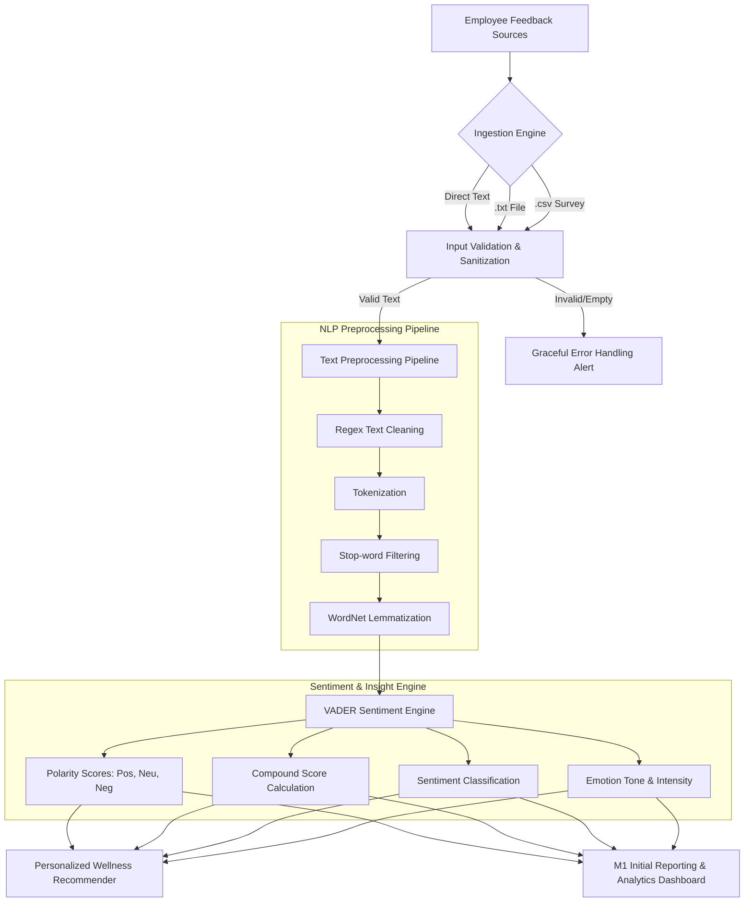

# 🌿 AI-Based Employee Wellness Management Platform

[](https://infyspringboard.onwingspan.com/)
[](https://www.python.org/)
[](https://opensource.org/licenses/MIT)
[](https://streamlit.io/)
[]()

An intelligent employee wellness monitoring and assistance platform developed for the **Infosys Springboard** initiative. The platform leverages Natural Language Processing (NLP) pipelines and sentiment engines (VADER Lexicon with planned Transformer expansions) to analyze employee feedback, detect early signals of workplace burnout, gauge organizational sentiment, and provide personalized wellness recommendations.

---

## 👨‍🏫 Project & Submission Details

- **Project Title:** `Infosys_AI_Based_Employee_Wellness_Management_Platform`
- **Initiative:** Infosys Springboard AI & ML Internship Program
- **Mentor Contact:** `springboardmentor06@gmail.com`
- **Author / Developer:** Deeksha Ganesh ([@DeekshaG96](https://github.com/DeekshaG96))
- **Repository URL:** [https://github.com/DeekshaG96/Infosys_AI_Based_Employee_Wellness_Management_Platform](https://github.com/DeekshaG96/Infosys_AI_Based_Employee_Wellness_Management_Platform)

---

## 🎯 Project Objectives

As outlined in the project curriculum:
1. **Text Ingestion System:** Real-time text field ingestion and multi-format batch file reading (`.txt`, `.csv`).
2. **Text Preprocessing Pipeline:** Automated cleaning, case normalization, punctuation filtering, tokenization, stop-word removal, and lemmatization.
3. **Sentiment Analysis Engine:** Rule-based and lexicon-driven sentiment scoring (VADER) for workplace feedback.
4. **Emotion Classification System:** Detecting core emotional tones (High Morale, Burnout/Exhaustion, Stress/Anxiety, Frustration, Neutral).
5. **Emotional Intensity Analysis:** Categorizing sentiment strength (High, Moderate, Low/Neutral).
6. **Personalized Recommendation Engine:** Mapping emotional indicators to targeted wellness interventions and institutional resources.
7. **User Management and Database:** Structured storage of feedback trends and longitudinal wellness metrics *(Roadmap)*.
8. **REST APIs:** Modular FastAPI endpoints for headless integration.
9. **Analytics Dashboard:** Interactive visual dashboard built with Streamlit.
10. **Testing and Deployment:** Comprehensive Pytest test suite covering NLP pipelines and error handling.

---

## 🏆 Milestone 1 (M1) Deliverables Checklist

All required M1 deliverables demonstrated and verified:

| # | M1 Deliverable Item | Status | Implementation Details |
| :-: | :--- | :-: | :--- |
| 1 | **Text input working** | ✅ | Interactive real-time multi-line text input area in Streamlit UI & CLI |
| 2 | **.txt file upload** | ✅ | Ingestion engine with UTF-8/Latin-1 auto-decoding and line parsing |
| 3 | **.csv file upload** | ✅ | Tabular survey ingestion with column auto-detection and pandas extraction |
| 4 | **Text preprocessing** | ✅ | URL, email, punctuation stripping, whitespace normalization, lowercasing |
| 5 | **Tokenization** | ✅ | NLTK `word_tokenize` with word boundary extraction |
| 6 | **Stop-word filtering** | ✅ | NLTK English stop-words filtering with negation preservation (`not`, `no`) |
| 7 | **Lemmatization** | ✅ | NLTK `WordNetLemmatizer` multi-POS root normalization |
| 8 | **VADER integration** | ✅ | `nltk.sentiment.vader.SentimentIntensityAnalyzer` integration |
| 9 | **Positive/negative/neutral sentiment** | ✅ | Standard cutoff thresholds: Compound ≥ 0.05 (Pos), ≤ -0.05 (Neg), else Neu |
| 10 | **Compound score** | ✅ | Normalized compound score metric (-1.0 to +1.0) with intensity gauge |
| 11 | **Initial report** | ✅ | Aggregate sentiment metrics, distribution charts, and downloadable `.md`/`.csv` |
| 12 | **Handling invalid/empty input** | ✅ | Safe error catching for empty text, whitespace-only files, corrupted CSVs |

---

## 🏗️ Architecture & Data Flow



---

## 📁 Repository Directory Structure

```text
Infosys_AI_Based_Employee_Wellness_Management_Platform/
│
├── data/
│   ├── raw/                              # Raw sample datasets
│   │   ├── sample_employee_feedback.txt  # Multi-line feedback sample file
│   │   ├── employee_wellness_survey_sample.csv # Multi-department survey sample
│   │   └── empty_test_sample.txt         # Edge-case testing sample
│   └── processed/                        # Cleaned data directory
│
├── models/
│   ├── sentiment_analyzer/               # VADER config & threshold definitions
│   │   └── config.json
│   └── recommenders/                     # Wellness intervention catalogs
│       └── rules.json
│
├── notebooks/
│   ├── 01_eda_and_preprocessing.ipynb    # EDA & text preprocessing pipeline
│   └── 02_model_training_and_evaluation.ipynb # Sentiment scoring & evaluation
│
├── src/                                  # Core application source code
│   ├── __init__.py
│   ├── preprocessing.py                  # Tokenization, stop-words, lemmatization
│   ├── sentiment.py                      # VADER sentiment scoring & emotion mapping
│   ├── ingestion.py                      # Text, .txt, and .csv validation engine
│   ├── recommender.py                    # Tailored wellness recommendation engine
│   ├── reporting.py                      # Report generator (metrics, summary, CSV)
│   ├── app.py                            # Interactive Streamlit dashboard
│   ├── main.py                           # CLI entry point and demo runner
│   ├── api/                              # FastAPI REST endpoints
│   │   ├── __init__.py
│   │   └── main.py
│   ├── components/                       # Modular UI widgets
│   └── utils/                            # Data helpers & utilities
│
├── tests/                                # Unit and integration test suite
│   ├── __init__.py
│   ├── test_preprocessing.py
│   ├── test_sentiment.py
│   └── test_ingestion.py
│
├── .gitignore                            # Standard Python & OS ignore rules
├── requirements.txt                      # Project dependencies
└── README.md                             # Comprehensive project documentation
```

---

## 🛠️ Tech Stack

- **NLP & Lexicon Analysis:** Python 3.10+, NLTK (VADER, WordNet, Stopwords, Punkt)
- **Data Manipulation:** Pandas, NumPy
- **Interactive UI & Dashboards:** Streamlit, Altair
- **REST API:** FastAPI, Uvicorn, Pydantic
- **Testing:** Pytest

---

## 🚀 Quickstart Guide

### 1. Clone the Repository
```bash
git clone https://github.com/DeekshaG96/Infosys_AI_Based_Employee_Wellness_Management_Platform.git
cd Infosys_AI_Based_Employee_Wellness_Management_Platform
```

### 2. Set Up a Virtual Environment
```bash
# Windows
python -m venv venv
venv\Scripts\activate

# Linux / macOS
python3 -m venv venv
source venv/bin/activate
```

### 3. Install Dependencies
```bash
pip install -r requirements.txt
```

### 4. Launch the Interactive Streamlit Web Application
```bash
streamlit run src/app.py
```
*The interactive dashboard will open automatically in your browser at `http://localhost:8501`.*

### 5. Alternatively, Run the Terminal CLI Demo
```bash
python src/main.py --demo
```

### 6. Run the REST API Backend
```bash
uvicorn src.api.main:app --reload --port 8000
```
*Interactive Swagger docs available at `http://localhost:8000/docs`.*

---

## 🧪 Running Unit Tests

Run the test suite to verify pipeline integrity:
```bash
pytest tests/ -v
```

---

## 🗺️ Roadmap & Next Milestones

- **Milestone 2 (M2):** Multi-class emotion classifier fine-tuning using DistilBERT / RoBERTa, emotion intensity quantification.
- **Milestone 3 (M3):** Longitudinal employee wellness database tracking, privacy-preserving anonymization filters.
- **Milestone 4 (M4):** Full end-to-end cloud deployment, automated notification dispatcher for wellness alerts.

---

## 📄 License

This project is licensed under the [MIT License](LICENSE).
